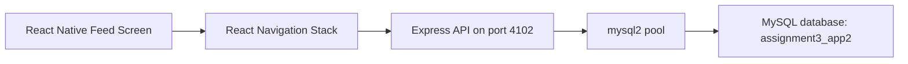
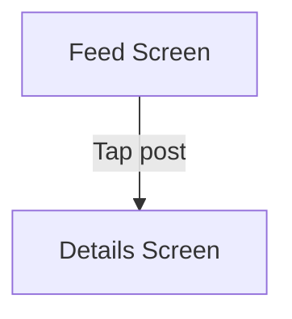

# Social Media Feed App

## Overview

This project is a lightweight social media feed application built with React Native, Expo SDK 54, Express, and MySQL. The app fetches posts from a dedicated database, presents them in a clean feed, and uses stack navigation to open a full post details screen.

The implementation focuses on mobile navigation, asynchronous API consumption, and clean separation between UI, API, and persistence layers.

## Architecture



## Key Features

- Fetches feed data from a dedicated MySQL database
- Displays post title, user ID, and preview body text
- Navigates to a detail screen with complete content
- Keeps app state simple and focused on read-only social content
- Uses isolated infrastructure so the app can run independently

## Technology Stack

- React Native with Expo SDK 54
- React Navigation
- Express.js
- mysql2
- MySQL via XAMPP

## API Contract

### `GET /posts`

Returns an array of posts:

```json
[
  {
    "id": 1,
    "user_id": 1,
    "title": "Welcome to the app",
    "body": "This feed is powered by..."
  }
]
```

## Database Design

Database: `assignment3_app2`

Table: `posts`

| Column | Type |
|---|---|
| id | INT, PK, AUTO_INCREMENT |
| user_id | INT |
| title | VARCHAR(150) |
| body | TEXT |

## Navigation Flow



## Project Structure

```text
.
├── App.js
├── AppMain.js
├── server.js
├── sql2.sql
├── package.json
└── .gitignore
```

## Run Locally

1. Start MySQL in XAMPP.
2. Import [`sql2.sql`](./sql2.sql).
3. Run `npm install`
4. Run `node server.js`
5. Run `npx expo start -c`

Backend port: `4102`

## Engineering Notes

- Navigation is implemented with a dedicated native stack to reflect a real mobile feed-to-details interaction.
- The API is intentionally narrow and purpose-driven, which keeps the project easy to reason about and test.
- The codebase uses a Windows-safe Expo entry setup for reliable bundling.
